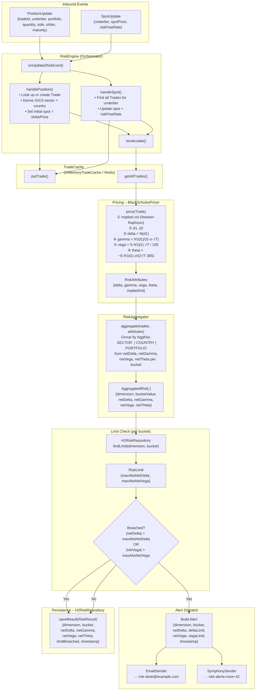
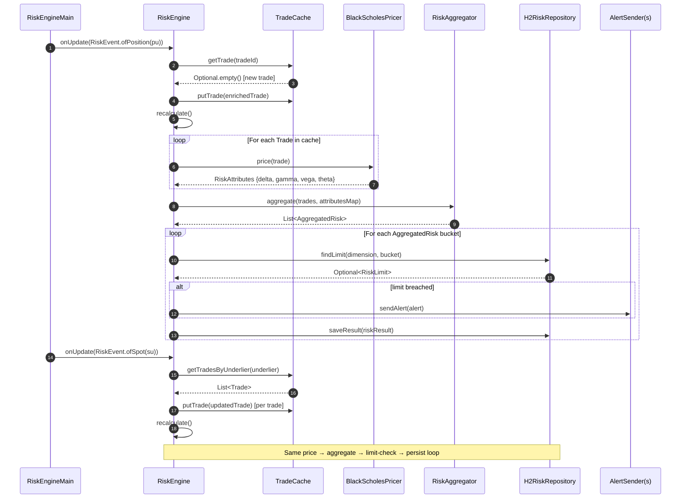

# Data Flow Diagram – Risk Engine

## End-to-End Event Flow



---

## Sequence Diagram – Single PositionUpdate + SpotUpdate Cycle



---

## Component Interaction Overview

```mermaid
flowchart LR
    subgraph Entrypoint
        MAIN["RiskEngineMain"]
    end

    subgraph Core
        ENGINE["RiskEngine\n(RiskObserver)"]
        AGGR["RiskAggregator"]
    end

    subgraph Infra
        CACHE["InMemoryTradeCache\nimplements TradeCache"]
        BS["BlackScholesPricer\nimplements Pricer"]
        H2["H2RiskRepository\n(H2 in-memory SQL)"]
        EM["EmailSender\nimplements AlertSender"]
        SY["SymphonySender\nimplements AlertSender"]
    end

    subgraph Model
        M1["Trade"]
        M2["RiskEvent\nPositionUpdate | SpotUpdate"]
        M3["RiskAttributes"]
        M4["AggregatedRisk"]
        M5["RiskLimit"]
        M6["RiskResult"]
        M7["Alert"]
    end

    MAIN -->|wires & drives| ENGINE
    ENGINE -->|reads/writes| CACHE
    ENGINE -->|price()| BS
    ENGINE -->|aggregate()| AGGR
    ENGINE -->|findLimit / saveResult| H2
    ENGINE -->|sendAlert| EM
    ENGINE -->|sendAlert| SY

    ENGINE -.->|consumes / produces| M1
    ENGINE -.->|consumes| M2
    ENGINE -.->|uses| M3
    ENGINE -.->|uses| M4
    ENGINE -.->|uses| M5
    ENGINE -.->|produces| M6
    ENGINE -.->|produces| M7
```
