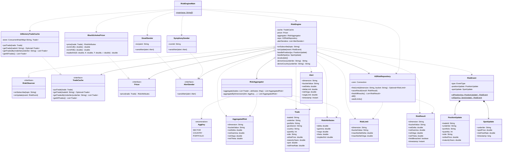

# UML Class Diagram – Risk Engine

```mermaid
classDiagram

    %% ── Interfaces ──────────────────────────────────────────────────────
    class RiskObserver {
        <<interface>>
        +onSubscribe(topic: String)
        +onUpdate(event: RiskEvent)
    }

    class TradeCache {
        <<interface>>
        +putTrade(trade: Trade)
        +getTrade(tradeId: String) Optional~Trade~
        +getTradesByUnderlier(underlier: String) List~Trade~
        +getAllTrades() List~Trade~
    }

    class Pricer {
        <<interface>>
        +price(trade: Trade) RiskAttributes
    }

    class AlertSender {
        <<interface>>
        +sendAlert(alert: Alert)
    }

    %% ── Core ─────────────────────────────────────────────────────────────
    class RiskEngine {
        -cache: TradeCache
        -pricer: Pricer
        -aggregator: RiskAggregator
        -repo: H2RiskRepository
        -alertSenders: List~AlertSender~
        +onSubscribe(topic: String)
        +onUpdate(event: RiskEvent)
        -handlePosition(pu: PositionUpdate)
        -handleSpot(su: SpotUpdate)
        -recalculate()
        -deriveGics(underlier: String) String
        -deriveCountry(underlier: String) String
    }

    class RiskAggregator {
        +aggregate(trades: List~Trade~, attributes: Map) List~AggregatedRisk~
        -aggregateByDimension(dim: AggKey, ...) List~AggregatedRisk~
    }

    %% ── Infrastructure ───────────────────────────────────────────────────
    class InMemoryTradeCache {
        -store: ConcurrentHashMap~String, Trade~
        +putTrade(trade: Trade)
        +getTrade(tradeId: String) Optional~Trade~
        +getTradesByUnderlier(underlier: String) List~Trade~
        +getAllTrades() List~Trade~
    }

    class BlackScholesPricer {
        +price(trade: Trade) RiskAttributes
        -normCdf(x: double) double
        -normPdf(x: double) double
        -impliedVol(S: double, K: double, T: double, r: double) double
    }

    class H2RiskRepository {
        -conn: Connection
        +findLimit(dimension: String, bucket: String) Optional~RiskLimit~
        +saveResult(result: RiskResult)
        +findAllResults() List~RiskResult~
        -ddl()
        -seedLimits()
    }

    class EmailSender {
        -recipient: String
        +sendAlert(alert: Alert)
    }

    class SymphonySender {
        -roomId: String
        +sendAlert(alert: Alert)
    }

    %% ── Model ────────────────────────────────────────────────────────────
    class Trade {
        -tradeId: String
        -underlier: String
        -portfolio: String
        -gicsSector: String
        -country: String
        -quantity: int
        -side: String
        -strikePrice: double
        -maturityYears: double
        -spot: double
        -riskFreeRate: double
    }

    class RiskEvent {
        -type: EventType
        -positionUpdate: PositionUpdate
        -spotUpdate: SpotUpdate
        +ofPosition(pu: PositionUpdate)$ RiskEvent
        +ofSpot(su: SpotUpdate)$ RiskEvent
    }

    class PositionUpdate {
        +tradeId: String
        +underlier: String
        +portfolio: String
        +quantity: int
        +side: String
        +strikePrice: double
        +maturityYears: double
    }

    class SpotUpdate {
        +underlier: String
        +spotPrice: double
        +riskFreeRate: double
        +timestamp: long
    }

    class RiskAttributes {
        +delta: double
        +gamma: double
        +vega: double
        +theta: double
        +impliedVol: double
    }

    class AggregatedRisk {
        +dimension: String
        +bucketValue: String
        +netDelta: double
        +netGamma: double
        +netVega: double
        +netTheta: double
    }

    class RiskLimit {
        +dimension: String
        +bucketValue: String
        +maxAbsNetDelta: double
        +maxAbsNetVega: double
    }

    class RiskResult {
        +dimension: String
        +bucketValue: String
        +netDelta: double
        +netGamma: double
        +netVega: double
        +netTheta: double
        +limitBreached: boolean
        +timestamp: Instant
    }

    class Alert {
        +dimension: String
        +bucketValue: String
        +netDelta: double
        +deltaLimit: double
        +netVega: double
        +vegaLimit: double
        +timestamp: Instant
    }

    class AggKey {
        <<enumeration>>
        SECTOR
        COUNTRY
        PORTFOLIO
    }

    %% ── Entry point ──────────────────────────────────────────────────────
    class RiskEngineMain {
        +main(args: String[])$
    }

    %% ── Relationships ────────────────────────────────────────────────────
    RiskEngine        ..|>  RiskObserver
    InMemoryTradeCache ..|> TradeCache
    BlackScholesPricer ..|> Pricer
    EmailSender       ..|>  AlertSender
    SymphonySender    ..|>  AlertSender

    RiskEngine        o-->  TradeCache
    RiskEngine        o-->  Pricer
    RiskEngine        o-->  RiskAggregator
    RiskEngine        o-->  H2RiskRepository
    RiskEngine        o-->  "0..*" AlertSender

    RiskEngine        ..>   RiskEvent
    RiskEngine        ..>   Trade
    RiskEngine        ..>   RiskAttributes
    RiskEngine        ..>   AggregatedRisk
    RiskEngine        ..>   RiskLimit
    RiskEngine        ..>   RiskResult
    RiskEngine        ..>   Alert

    RiskEvent         *-->  PositionUpdate
    RiskEvent         *-->  SpotUpdate

    RiskAggregator    ..>   AggKey
    RiskAggregator    ..>   AggregatedRisk
    RiskAggregator    ..>   Trade
    RiskAggregator    ..>   RiskAttributes

    H2RiskRepository  ..>   RiskLimit
    H2RiskRepository  ..>   RiskResult

    RiskEngineMain    ..>   RiskEngine
    RiskEngineMain    ..>   InMemoryTradeCache
    RiskEngineMain    ..>   BlackScholesPricer
    RiskEngineMain    ..>   H2RiskRepository
    RiskEngineMain    ..>   EmailSender
    RiskEngineMain    ..>   SymphonySender
```
